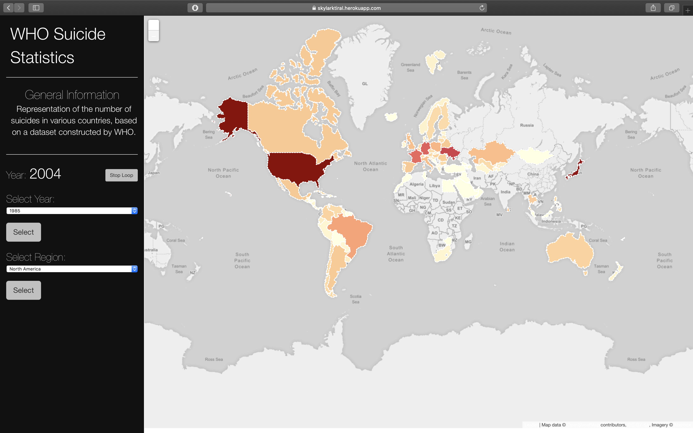

# SUICIDE ACTIVITY

This is a web application, uses a map to demonstrate the number of people that have commited suicides from 1985 to 2013. The dataset is progived by the World Health Organization.

Hosted on https://skylarktiral.herokuapp.com/

## Dependencies
1. NodeJS
2. MongoDB

## How To Run
1. Make sure all the above dependencies are installed.
2. Hit `git clone https://github.com/hrishikeshpaul/whodata.git` 
3. `cd whodata`
4. `npm install`
5. `npm start`
6. Open any browser(Preferably Google Chrome) and navigate to `localhost:3000/`

